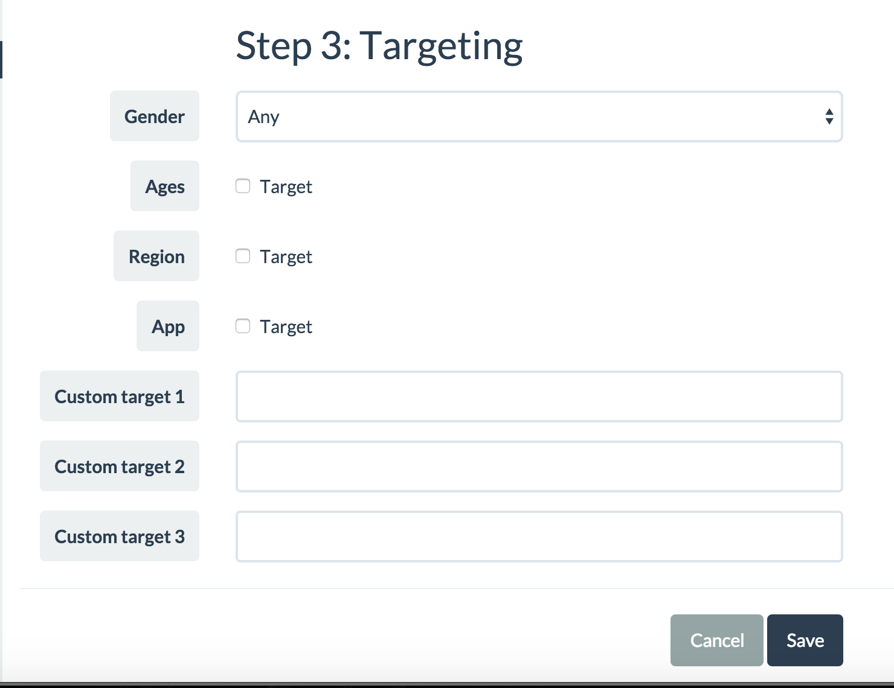

# BuzzScreen Custom Targeting
---
- 퍼블리셔 측에서 캠페인을 자체적인 기준으로 타게팅하려 할 때 사용한다.
- 최대 3가지의 타게팅 정보를 설정할 수 있다.
- 캠페인 추가 시 admin에서 커스텀 타게팅 정보를 넣어준다.
- 앱 내의 userProfile 객체에 커스텀 타게팅 정보를 넣어준다.
- 캠페인에는 타게팅 정보가 있는데 유저 프로필의 타게팅 정보가 누락되었을때는 해당 캠페인 할당이 되지 않는다.

## 타게팅 설정 방법

(1) admin에서 캠페인에 타게팅 정보 할당



**어떠한 형식이든 상관 없이 캠페인과 userProfile 간에 일관성만 있으면 된다.**

(2) 퍼블리셔의 앱에서 userProfile 객체에 정보 할당
```java
// activate 함수 호출 전 userProfile 설정 부분에 다음과 같이 정보를 할당한다.
UserProfile userProfile = BuzzScreen.getInstance().getUserProfile();
	userProfile.setUserId(...);
	userProfile.setBirthYear(...);
	...
	userProfile.setCustomTarget1("target1");
    userProfile.setCustomTarget2("targetA");
    userProfile.setCustomTarget3("target가");

```
**String 형태로 정보를 할당한다.**

- 해당 유저의 프로필 객체에 커스텀 타게팅 정보가 할당되어 캠페인을 할당받을 때 이 정보를 추가하여 서버로 할당 요청을 보내게 된다. 
- 서버는 요청을 받으면 할당할 캠페인을 고르는데, 만약 특정 캠페인에 커스텀 타게팅 정보가 존재할 경우 유저의 **동일한 번호**의 커스텀 타게팅 정보가 존재하고, 내용이 동일할 때만 그 캠페인을 유저에게 할당시킨다.

### **주의사항**
CustomTarget 1, 2, 3 은 서로 호환되지 않는다. 각각 할당 가능한 타게팅 정보의 목록은 겹치는 항목 없이 완전히 구분되어야 한다. 
> 예를 들어 캠페인의 CustomTarget1 에 "music" 을 할당했으나, 유저의 CustomTarget2에 "music"을 할당한 경우에는 타게팅에 실패하고 해당 캠페인은 그 유저에게 나가지 않는다.


**따라서, 퍼블리셔에서 자체적인 기준으로 각 커스텀 타겟 슬롯마다 카테고리를 나누어서 관리하는 것이 중요하다.**
