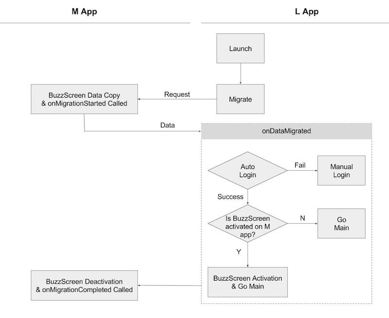

## L App Migration Guide
Reference : **`sample_lock`**

### 1. Buzzscreen SDK should be integrated into L app.
- Buzzscreen SDK version 1.6.0 or higher
- `app_license` and `com.buzzvil.locker.mediation.baidu.plist` values should be newly issued (please contact a Buzzvil AM). 
    `AndroidManifest.xml` 
    ```xml
    <manifest>
        <application>
            ...
            <!-- Configuration for BuzzScreen-->
            <!-- <app_license> should be newly issued and different from the value used on M app. -->
            <!-- Replace <plist> with newly issued value.  -->
            <meta-data
                android:name="app_license"
                android:value="<app_license>" />
            <meta-data
                android:name="com.buzzvil.locker.mediation.baidu.plist"
                android:value="<plist>" />
        </application>
    </manifest>
    ```

### 2. Modify `build.gradle` 
       
#### Add `manifestPlaceholders`

```groovy
android {
   defaultConfig {
       // Please replace my_app_key with the app key given for BuzzScreen integration process
       manifestPlaceholders = [buzzScreenAppKey:"my_app_key"]
   }
}
```

#### Add the following to `dependencies`
**Please take extra caution of the library name**

```groovy
dependencies {
   compile "com.buzzvil.buzzscreen.ext:migration-to:$buzzscreenExtentionVersionName"
}
```

### 3. Add necessary codes to Application Class
- `MigrationTo.init(Context context, String mainPackageName)`

    L app initiation code for migration

    **Parameters**
    - `context` : pass `this` for Application context.  
    - `mainPackageName` : M app Package name


**Example**

```java
public class App extends Application {

    @Override
    public void onCreate() {
        super.onCreate();

        // Initiation code for Buzzscreen. This code is same for both M App and L App.
        BuzzScreen.init("app_key", this, CustomLockerActivity.class, R.drawable.image_on_fail);

        // code for migration
        // example code uses com.buzzvil.buzzscreen.sample_main for the M app package name
        MigrationTo.init(this, "com.buzzvil.buzzscreen.sample_main");
    }
}

```

### 4. Migration Execution

Buzzscreen migration refers to a process of trasferring data from M app to L app and of activating lockscreen on L app using the data. L app can receive data from M app using this SDK during migration process. Based on received data, `BuzzScreen.getInstance().activate()` should be called in order to activate lockscreen on L app.

User data can be transferred when `MigrationFrom.bind` is called on M app. This data can be used for user login on L app when activating the lockscreen. After data migration is finished, M app lockscreen will be automatically deactivated and L app lockscreeen will be activated when `activate()` is called. 

#### Normal Migration Flow


#### Add codes for migration
The following code should be added to activity on which the migration is being executed. migrate function should be called on the very first activity of L app. 

- `migrate(OnMigrationListener onMigrationListener)`

    Migrate method is a part of MigrationTo class. OnMigrationListener callback is used to transfer data from M App, which shall be used for lockscreen activation logic. 

    **Parameters**
    - `onMigrationListener` : Migration listener
        - `void onAlreadyMigrated()` : This method is called if migration is already processed.
        - `void onDataMigrated(Bundle data, boolean usedLockscreen)` : This method is called when data transfer process from M app is completed. L app can determine whether to activate lockscreen based on transferred data including UserProfile data and lockscreen activation status on M app. 
            - `data` : Transferred data via `onMigrationStarted` from M App migration process
            - `usedLockscreen` : lockscreen activation status on M app
        - `void onError()` : This method is called for the following cases. 
            - `MAIN_APP_NOT_INSTALLED` : When M app is not installed. Just as normal lockscreen activation process on M App, individual login process is required on L app.
            - `MAIN_APP_MIGRATION_NOT_SUPPORTED` : When M app version is lower than migration implemented version, L app cannot detect whether M app lockscreen is activatd or not. In order to prevent both M app and L app lockscreens from being activated, L app requests M app to be updated. 
            - `UNKNOWN_ERROR` : Other errors. Cause of errors varies. Depending on the type of error, retry logic or individual login process can be implemented.
            
**Example**
```java
public class IntroActivity extends AppCompatActivity {

    private App app;
    private MigrationTo migration;
    
    // M app lockscreen activation status
    private boolean usingLockScreen = false;

    @Override
    protected void onCreate(Bundle savedInstanceState) {
        super.onCreate(savedInstanceState);
        setContentView(R.layout.activity_intro);
        
        // sample login code is included in Application class.
        app = (App) getApplicationContext();

        // initiation code for Buzzscreen (as before).
        BuzzScreen.getInstance().launch();
    }

    @Override
    protected void onResume() {
        super.onResume();
        if (app.isLoggedIn()) {
            // Main activity of the app will be launched when a user is already logged in.
            startMainActivity();
        } else {
            // Either automatic login via migration or manual(individual) login shall be implemented depending on user's login status.
            // In order to minimize user churn, implementing automatic login process is recommended. 
            migration = new MigrationTo();
            migration.migrate(new MigrationTo.OnMigrationListener() {
                
                /**
                 * After the very first migration is processed, onAlreadyMigrated() will be called whenever migrate method is called. 
                 */
                @Override
                public void onAlreadyMigrated() {
                    manualLogin();
                }
                
                /**
                 * This method is called after data from M app is transferred and UserProfile information is updated. 
                 *
                 * @param data transferred data via `onMigrationStarted` during migration process
                 * @param usingLockScreen Buzzscreen activation status on M App
                 */
                @Override
                public void onDataMigrated(Bundle data, boolean usingLockScreen) {
                    Log.d(TAG, "OnMigrationListener.onDataMigrated");
                    IntroActivity.this.usingLockScreen = usingLockScreen;
                    if (data != null) {
                        // Automatic login should be processed using user data transferred from M app.
                        // If automatic login is succeeded, usingLockScreen boolean will be used to determine lockscreen activation on L app.
                        // If automatic login is failed, manual login shall be processed. 
                        String userId = data.getString("user_id");
                        requestLogin(userId);
                    } else {
                        // Manual login process shall be implemented here as there is no data transferred from M App
                        useManualLogin();
                    }
                }

                @Override
                public void onError() {
                    Log.e(TAG, "OnMigrationListener.onError");
                    if (!Utils.isAppInstalled(IntroActivity.this, App.MAIN_APP_PACKAGE)) {
                        // Individual login process shall be implemented in case M app is not installed.
                        Toast.makeText(IntroActivity.this, "Main app is not installed.\nPlease install it or login.", Toast.LENGTH_LONG).show();
                        useManualLogin();
                    } else if (Utils.getAppVersionCode(IntroActivity.this, App.MAIN_APP_PACKAGE) < SUPPORTED_MAIN_APP_VERSION) {
                        // when M app version is lower than migration implemented version, L app requests to update M app.
                        alertMustUpdate();
                    } else {
                        // Either manual login process or retry logic shall be implemented in case of temporary errors during migration
                        useManualLogin();
                    }
                }
            });
        }
    }
    
    @Override
    public void onPause() {
        super.onPause();
        if (migration != null) {
            // Call this method to pause migration process
            // onDataMigrated or onAlreadyMigrated might be called in onPause unless the process is aborted here. 
            migration.abort();    
        }
    }
}

```
Detail implementation of above codes can be found in `sample_lock` > `IntroActivity`
        
