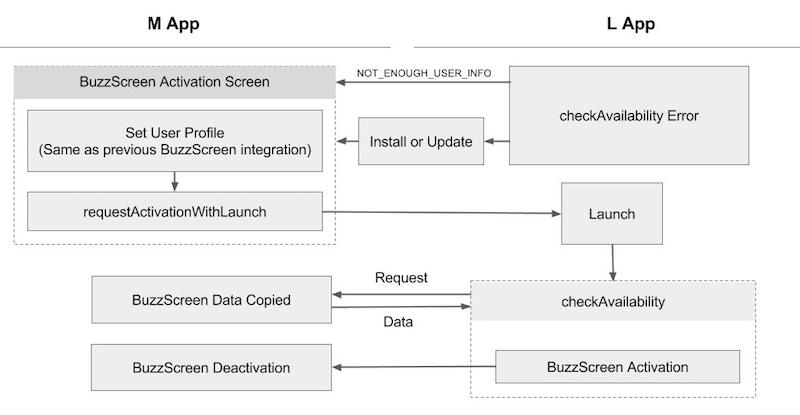

## L App Migration Implementation

Reference : **`sample_lock_light`**

- L app is capable of activating a lockscreen using user information and usage agreement gathered from M app. Users who have been using M app lockscreen are considered to have already agreed with using the lockscreen.
    > When required information are missing, users will be notififed to activate the lockscreen on [lockscreen activation page](LIGHT-MIGRATION-M-EN.md#3-Lockscreen-Opt-in-page-modification). Deep-linking to **M app Lockscreen Activation Page** would help implement a user-friendly experience.
- L app lockscreen will be automatically deactivated when either `MigrationHost.requestDeactivation()` is called on M app at logout or M app is removed.
- User profile setting flow inside the L app is not required for L app Lockscreen integration.
    > User info transferred from M app via the migration SDK is automatically used.


### 1. Modify `build.gradle`

#### Add `manifestPlaceholders`

```groovy
android {
    defaultConfig {
        // Please replace my_app_key with the app key given for BuzzScreen integration process
        manifestPlaceholders = [buzzScreenAppKey:"my_app_key"]
    }
}
```

#### Add the followings to `dependencies`
Add the BuzzScreen library as well as the L app migration library. It requires BuzzScreen ver 1.6.3 or higher.
> Existing BuzzScreen SDK is required to activate the lockscreen on L app.

```groovy
dependencies {
    
    // BuzzScreen Integration (same as M app's)
    compile 'com.buzzvil:buzzscreen:1.+'
    
    // Migration library for L app. The version MUST be same as migration-host's
    compile 'com.buzzvil.buzzscreen.ext:migration-client:0.9.2'
}
```


### 2. Modify `AndroidManifest.xml`
Renewed `app_license` and `com.buzzvil.locker.mediation.baidu.plist` values should be used and applied on L app in order to integrate BuzzScreen.
```xml
<manifest>
    <application>
        ...
        <!-- Configuration for BuzzScreen-->
        <!-- Replace <app_license> to new one that is different from existing one. -->
        <!-- Replace <plist> to new one that is different from existing one. -->
        <meta-data
            android:name="app_license"
            android:value="<app_license>" />
        <meta-data
            android:name="com.buzzvil.locker.mediation.baidu.plist"
            android:value="<plist>" />
    </application>
</manifest>
```


### 3. Add necessary codes to Application Class
Call `Buzzscreen.init` for BuzzScreen integration and `MigrationClient.init` for migration in that order.

- `MigrationClient.init(Context context, String mainPackageName)`

    Initialization code of L app for migration
    
    **Parameters**
    - `context` : pass the Application context with `this`. 
    - `mainPackageName` : M App Package name
    
- `MigrationClient.setOnDeactivatedByMainAppListener(OnDeactivatedByMainAppListener listener)`

    This method registers a listener that is called when lockscreen on L app is disabled either when `MigrationHost.requestDeactivation()` is called from M app or M app is removed.
    
    **Parameters**
    - `OnDeactivatedByMainAppListener`
        - `onDeactivated` : Called when L app lockscreen is disabled

**Example**

```java
public class App extends Application {

    @Override
    public void onCreate() {
        super.onCreate();
        // The existing code to initialize Buzzscreen
        BuzzScreen.init("app_key", this, SimpleLockerActivity.class, R.drawable.image_on_fail);

        // Initialization for migration
        // The example code uses com.buzzvil.buzzscreen.sample_main_light for M app package name.
        MigrationClient.init(this, "com.buzzvil.buzzscreen.sample_main_light");
        
        // An example of registering listener that is called when L app lockscreen is disabled by M app.
        MigrationClient.setOnDeactivatedByMainAppListener(new MigrationClient.OnDeactivatedByMainAppListener() {
            @Override
            public void onDeactivated() {
                Toast.makeText(App.this, "Disabling the lockscreen for Main App status change(Removed, Logout, etc.)", Toast.LENGTH_LONG).show();
            }
        });
    }
}

```


### 4. Lockscreen Activation and Migration

Lockscreen activation on L app works as follows: **Information transfer from M app -> BuzzScreen Activation**. Once L app lockscreen is activated, M app lockscreen is deactivated. Migration starts with the above process when L app launches, and L app's lockscreen is activated using M app's user information henceforth.
> During BuzzScreen activation process, `BuzzScreen.getInstance().launch()` -> `BuzzScreen.getInstance().activate()` is still used as in usual BuzzScreen activation process.

To get data transferred from M app, `MigrationClient` provides the following function.

- `checkAvailability(OnCheckAvailabilityListener listener)`

    This method is used to obtain data needed for BuzzScreen activation from M app asynchronously, and activate the lockscreen automatically depending on M app status. Put this in `onResume` on the first activity of L app so that this is called everytime L app launches.
    > Condition for automatic lockscreen activation: either M app lockscreen is being used or activating L app by calling `MigrationHost.requestActivationWithLaunch()`
    
    **Parameters**
    - `OnCheckAvailabilityListener`
        - `onAvailable(boolean autoActivated)` : Called when BuzzScreen can be activated.
            - `autoActivated` : `true` when lockscreen is automatically activated, `false` otherwise
        - `onError(AvailabilityCheckError error)` : Called when BuzzScreen cannot be activated.
            - `MAIN_APP_NOT_INSTALLED` : In this case, redirect users to M app install process as M app is not installed.
            - `MAIN_APP_MIGRATION_NOT_SUPPORTED` : In this case, redirect users to update M app version, as current M app version does not support migration.
            - `NOT_ENOUGH_USER_INFO` : This is returned when user information are not enough for BuzzScreen activation. Users should be redirectd to lockscreen activation page on M app.
            - `UNKNOWN_ERROR` : Wrong integration or temporary error. In case of temporary error, lead to retry.

    - When lockscreen is activated via `onAvailable` at `checkAvailability`, please refer to [L App Lockscreen Activation process](LIGHT-MIGRATION-M-EN.md#L-app-lockscreen-activation-process)
    - Refer the following image for handling `onError`

#### checkAvailability Error Flow


            
**Example**
```java
public class MainActivity extends AppCompatActivity {

    private MigrationClient migrationClient = new MigrationClient();
    
    @Override
    protected void onCreate(Bundle savedInstanceState) {
        super.onCreate(savedInstanceState);
        setContentView(R.layout.activity_main);
        
        // Code for BuzzScreen integration
        BuzzScreen.getInstance().launch();
    }

    @Override
    protected void onResume() {
        super.onResume();
        migrationClient.checkAvailability(new MigrationClient.OnCheckAvailabilityListener() {
            @Override
            public void onAvailable(boolean autoActivated) {
                if (autoActivated) {
                    showAutoActivatedDialog();
                }
                // Lockscreen on/off layout
                showSwitchLayout();
            }

            @Override
            public void onError(MigrationClient.AvailabilityCheckError error) {
                switchActivateLock.setChecked(false);
                switch (error) {
                    case MAIN_APP_NOT_INSTALLED:
                        sendToPlayStore("App is not installed.\nMove to installation link.");
                        break;
                    case MAIN_APP_MIGRATION_NOT_SUPPORTED:
                        sendToPlayStore("App is not the latest version.\nMove to installation link.");
                        break;
                    case NOT_ENOUGH_USER_INFO:
                        // Gather user information and usage agreement via M app.
                        sendToMain();
                        break;
                    case UNKNOWN_ERROR:
                        Toast.makeText(MainActivity.this, "Error. Please retry.", Toast.LENGTH_SHORT).show();
                        break;
                }
            }
        });
    }
    
    @Override
    public void onPause() {
        super.onPause();
        // Call to pause checkAvailability.
        // onAvailable or onError is called unless stop here.
        migrationClient.abort();    
    }
}

```


### Creating market-ready L app using sample
`sample_lock_light` contains what this guide entails as well as other small features. Thus, by customizing the `sample_lock_light` a bit, you can get a simple market-ready version of a lockscreen app.
> Please contact Buzzvil for any issues or questions regarding the sample app.

1. Modify `build.gradle` : Replace `my_app_key` with the app key given for BuzzScreen integration process and `applicationId` to new lockscreen app package name.
2. Modify `AndroidManifest.xml` : Replace `<app_license>` and `<plist>` with newly published value respectively.
3. Setting M app lockscreen activation page deep link : Set `DEEP_LINK_ONBOARDING` in file `App.java` as M app [lockscreen activation page](LIGHT-MIGRATION-M-EN.md#3-Lockscreen-Opt-in-page-modification) deep link.

##### Design Change
- Icon : change `ic_launcher.png`
- Color : change the main color via modifying `res/colors.xml`
- Logo : change the logo on tool bar at `activity_main.xml`
- [Customizing Lockscreen Notification](https://github.com/Buzzvil/buzzscreen-sdk-publisher/blob/master/docs/LOCKSCREEN-SERVICE-NOTIFICATION.md)
