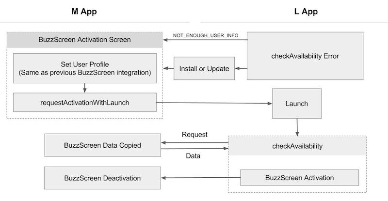

## L앱 마이그레이션 구현

참고 샘플 : **`sample_lock_light`**

- L앱은 M앱으로부터 잠금화면에 필요한 정보와 사용자 동의를 획득하여 잠금화면을 활성화 할 수 있습니다. 기존에 M에서 잠금화면을 사용하고 있던 유저는 이미 잠금화면 사용 동의가 되었다고 간주합니다.
    > 필요한 정보가 없을 경우 M앱의 [잠금화면 활성화 화면](LIGHT-MIGRATION-M.md#3-잠금화면-활성화-화면-변경)을 통해 잠금화면을 활성화해야 한다고 유저에게 알려주게 됩니다. 이 과정에서 **M앱의 잠금화면 활성화 화면**으로 연결되는 딥링크가 있으면 자연스러운 유저경험을 만들 수 있습니다.
- M앱에서 로그아웃 시점에 `MigrationHost.requestDeactivation()` 를 호출하거나 M앱이 제거되면 자동으로 L앱의 잠금화면이 비활성화됩니다.
- L앱의 버즈스크린 연동에서 유저 정보 설정 과정은 따로 진행하지 않아도 됩니다.
    > 마이그레이션 SDK를 통해 M앱에서 설정된 버즈스크린 유저 정보를 그대로 가져와서 사용하게 됩니다.


### 1. `build.gradle` 설정

#### `manifestPlaceholders` 추가

```groovy
android {
    defaultConfig {
        // my_app_key 에는 버즈스크린 연동시 발급받은 앱키를 입력합니다.
        manifestPlaceholders = [buzzScreenAppKey:"my_app_key"]
    }
}
```

#### `dependencies` 에 추가
L앱을 위한 마이그레이션 라이브러리뿐만 아니라 버즈스크린 라이브러리도 추가합니다. 이것도 M앱과 마찬가지로 버즈스크린 1.6.3 버전 이상이 필요합니다.
> L앱에서도 잠금화면을 활성화시키기 위해서는 기존 버즈스크린 SDK가 필요합니다.

```groovy
dependencies {
    
    // M앱과 동일한 버즈스크린 연동
    compile 'com.buzzvil:buzzscreen:1.+'
    
    // L앱을 위한 마이그레이션 라이브러리. migration-host 와 버전이 반드시 일치해야합니다.
    compile 'com.buzzvil.buzzscreen.ext:migration-client:0.9.2'
}
```


### 2. `AndroidManifest.xml` 변경
버즈스크린 연동을 위해 `app_license`와 `com.buzzvil.locker.mediation.baidu.plist`는 새로 발급(버즈빌 문의)받아서 L앱에 적용해야 합니다.
```xml
<manifest>
    <application>
        ...
        <!-- Configuration for BuzzScreen-->
        <!-- <app_license> 를 기존 M앱과 다른 새로운 값으로 교체합니다. -->
        <!-- <plist> 를 기존 M앱과 다른 새로운 값으로 교체합니다. -->
        <meta-data
            android:name="app_license"
            android:value="<app_license>" />
        <meta-data
            android:name="com.buzzvil.locker.mediation.baidu.plist"
            android:value="<plist>" />
    </application>
</manifest>
```


### 3. Application Class 에 코드 추가
버즈스크린 연동을 위한 `BuzzScreen.init` 와 마이그레이션 연동을 위한 `MigrationClient.init`를 순서대로 호출합니다.

- `MigrationClient.init(Context context, String mainPackageName)`

    마이그레이션을 위한 L앱의 초기화 코드
    
    **Parameters**
    - `context` : Application context 를 `this` 로 전달
    - `mainPackageName` : M앱의 패키지명
    
- `MigrationClient.setOnDeactivatedByMainAppListener(OnDeactivatedByMainAppListener listener)`

    M앱에서 `MigrationHost.requestDeactivation()`를 호출하거나 M앱을 삭제하여 L앱에서의 잠금화면이 비활성화되는 경우 호출되는 리스너를 등록합니다. 
    
    **Parameters**
    - `OnDeactivatedByMainAppListener`
        - `onDeactivated` : L앱의 잠금화면이 비활성화 될 때 호출됨

**사용 예시**

```java
public class App extends Application {

    @Override
    public void onCreate() {
        super.onCreate();
        // 기존 버즈스크린 초기화 코드.
        BuzzScreen.init("app_key", this, SimpleLockerActivity.class, R.drawable.image_on_fail);

        // 마이그레이션을 위한 코드
        // M앱의 패키지명이 com.buzzvil.buzzscreen.sample_main_light 인 경우 사용 예시
        MigrationClient.init(this, "com.buzzvil.buzzscreen.sample_main_light");
        
        // M앱에 의해 L앱에서의 잠금화면이 비활성화되는 경우 호출되는 리스너를 등록 예시
        MigrationClient.setOnDeactivatedByMainAppListener(new MigrationClient.OnDeactivatedByMainAppListener() {
            @Override
            public void onDeactivated() {
                Toast.makeText(App.this, "Main App의 상태가 변경(앱 삭제, 로그아웃, 탈퇴 등)되어 잠금화면을 비활성화합니다.", Toast.LENGTH_LONG).show();
            }
        });
    }
}

```


### 4. 잠금화면 활성화와 마이그레이션

L앱에서의 잠금화면 활성화는 **M앱에서 정보 가져오기 -> 버즈스크린 활성화** 과정으로 진행됩니다. 그리고 L앱의 잠금화면이 활성화되면 자동으로 M앱의 잠금화면이 비활성화 됩니다. L앱이 실행될 때 이 과정이 진행되면서 마이그레이션이 되고, 이후에도 M앱의 정보를 통해 L앱의 잠금화면을 활성화시키게 됩니다.
> 버즈스크린 활성화 과정에서는 기존 버즈스크린 연동처럼 `BuzzScreen.getInstance().launch()` -> `BuzzScreen.getInstance().activate()` 를 그대로  사용합니다.

M앱의 정보를 가져오기 위해 `MigrationClient`에서 다음 함수를 제공합니다.

- `checkAvailability(OnCheckAvailabilityListener listener)`

    비동기로 M앱에서 버즈스크린 활성화에 필요한 정보들을 가져오고, M앱의 상태에 따라 자동으로 잠금화면을 활성화합니다. L앱 진입화면의 `onResume` 에서 호출하여 L앱 진입시 항상 수행되도록 합니다.
    > 자동으로 잠금화면 활성화 되는 조건 : M앱에서 잠금화면을 사용중이거나 `MigrationHost.requestActivationWithLaunch()`를 호출하여 L앱을 실행한 경우.
    
    **Parameters**
    - `OnCheckAvailabilityListener`
        - `onAvailable(boolean autoActivated)` : 버즈스크린을 활성화 할 수 있는 경우 호출됩니다.
            - `autoActivated` : 자동으로 잠금화면이 활성화되면 `true` 그렇지않으면 `false`
        - `onError(AvailabilityCheckError error)` : 버즈스크린을 사용할 수 없는 경우 호출됩니다.
            - `MAIN_APP_NOT_INSTALLED` : M앱이 설치되지 않은 경우로 M앱의 설치를 유도합니다.
            - `MAIN_APP_MIGRATION_NOT_SUPPORTED` : M앱이 마이그레이션을 지원하지 않는 버전으로 M앱의 업데이트를 유도합니다.
            - `NOT_ENOUGH_USER_INFO` : 버즈스크린을 활성화하는데 필요한 정보가 충분하지 않은 경우 호출됩니다. M앱의 잠금화면 활성화 페이지로 이동시킵니다.
            - `UNKNOWN_ERROR` : 잘못된 연동 혹은 일시적인 에러로 발생할 수 있습니다. 일시적인 에러인 경우에는 재시도를 유도합니다.

    - `checkAvailability`에서 `onAvailable`을 통해 잠금화면이 활성화되는 경우는 [L앱 잠금화면 활성화 흐름](LIGHT-MIGRATION-M.md#l앱-잠금화면-활성화-흐름)을 참고합니다.
    - `onError` 처리 흐름은 다음 그림을 참고합니다.  

#### checkAvailability Error Flow


            
**사용 예시**
```java
public class MainActivity extends AppCompatActivity {

    private MigrationClient migrationClient = new MigrationClient();
    
    @Override
    protected void onCreate(Bundle savedInstanceState) {
        super.onCreate(savedInstanceState);
        setContentView(R.layout.activity_main);
        
        // 기존 버즈스크린 연동
        BuzzScreen.getInstance().launch();
    }

    @Override
    protected void onResume() {
        super.onResume();
        migrationClient.checkAvailability(new MigrationClient.OnCheckAvailabilityListener() {
            @Override
            public void onAvailable(boolean autoActivated) {
                if (autoActivated) {
                    showAutoActivatedDialog();
                }
                // 잠금화면을 on/off 할 수 있는 레이아웃 구성 
                showSwitchLayout();
            }

            @Override
            public void onError(MigrationClient.AvailabilityCheckError error) {
                switchActivateLock.setChecked(false);
                switch (error) {
                    case MAIN_APP_NOT_INSTALLED:
                        sendToPlayStore("앱이 설치되어 있지 않습니다.\n설치 링크로 이동합니다.");
                        break;
                    case MAIN_APP_MIGRATION_NOT_SUPPORTED:
                        sendToPlayStore("앱이 최신 버전이 아닙니다.\n설치 링크로 이동합니다.");
                        break;
                    case NOT_ENOUGH_USER_INFO:
                        // Main App 을 통해 유저 정보 및 사용자 동의를 받을 수 있도록 합니다.
                        sendToMain();
                        break;
                    case UNKNOWN_ERROR:
                        Toast.makeText(MainActivity.this, "에러가 발생했습니다. 다시 시도해주세요.", Toast.LENGTH_SHORT).show();
                        break;
                }
            }
        });
    }
    
    @Override
    public void onPause() {
        super.onPause();
        // checkAvailability 를 중단하기위해 호출합니다.
        // 여기서 중단하지 않으면 onAvailable or onError 가 호출됩니다.
        migrationClient.abort();    
    }
}

```


### 샘플을 활용하여 잠금화면 전용앱 만들기
`sample_lock_light`에서 확인할 수 있는 샘플 잠금화면 앱은 위 가이드의 구현을 담았을 뿐만 아니라 최소한의 기능도 구현되어있습니다. 따라서 `sample_lock_light` 을 다운받고 다음 과정만 진행해도 잠금화면 앱이 완성됩니다.
> 샘플앱에 대해 궁금한 사항이나 지원이 필요하다면 언제든지 버즈빌에 문의주세요.

1. `build.gradle` 변경 : `my_app_key`는 기존에 발급받았던 버즈스크린 앱키로 변경하고, `applicationId` 는 새롭게 만드는 잠금화면 앱의 패키지명으로 변경합니다.
2. `AndroidManifest.xml` 변경 : `<app_license>`, `<plist>` 를 새롭게 발급받은 값으로 변경합니다.
3. M앱 잠금화면 활성화 페이지 딥링크 설정 : `App.java` 파일 내의 `DEEP_LINK_ONBOARDING` 를 M앱 [잠금화면 활성화 화면](LIGHT-MIGRATION-M.md#3-잠금화면-활성화-화면-변경) 딥링크로 설정합니다. 

##### 간단한 디자인 변경
- 아이콘 : `ic_launcher.png` 변경
- 색상 : `res/colors.xml` 변경만으로 메인 색상 적용 가능
- 로고 : `activity_main.xml`에서 툴바의 로고 변경
- [잠금화면 노티피케이션 커스텀](https://github.com/Buzzvil/buzzscreen-sdk-publisher/blob/master/docs/LOCKSCREEN-SERVICE-NOTIFICATION.md)
