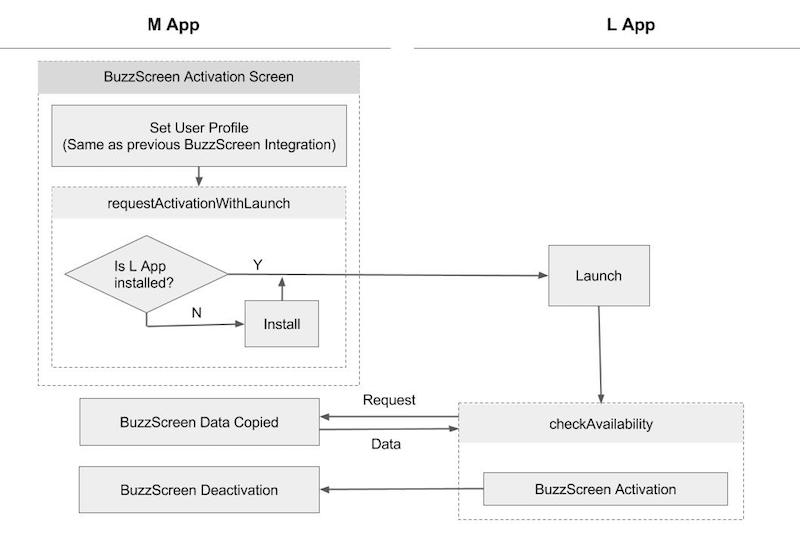

## M App Migration Implementation

Reference : **`sample_main_light`**

- M app provides necessary data required to activate lockscreen in L app.
    > If M app is unable to provide the data, lockscreen cannot be activated in L app. In this case, users should be directed to a lockscreen activation page on M app. This process is done through [New Activation Function](LIGHT-MIGRATION-M-EN.md#3-Lockscreen-Opt-in-page-modification), which is provided in the Migration SDK.
- Everytime L app is launched, it checks the status of M app and determines if lockscreen can be activated on L app.
    > When M app is removed, lockscreen from L app is automatically deactivated.

### 1. Modify `build.gradle`

#### Add `manifestPlaceholders`

```groovy
android {
    defaultConfig {
        // Please replace my_app_key with the app key provided for BuzzScreen integration process
        manifestPlaceholders = [buzzScreenAppKey:"my_app_key"]
    }
}
```

#### Add the followings to `dependencies`
Migration library for M app should be added, and Buzzscreen SDK version must be updated to 1.6.3 or higher.
> No additional process is required if the Buzzscreen SDK version is `1.+` as it is automatically updated, but it is necessary to set the version as 1.6.3 or higher if the version is explicitly specified.

```groovy
dependencies {
    
    // Buzzscreen Integration (as before)
    compile 'com.buzzvil:buzzscreen:1.+'
    
    // Migration library for M app. Please take extra caution of the library name as it is different for L app. 
    compile 'com.buzzvil.buzzscreen.ext:migration-host:0.9.2'
}
```


### 2. Add necessary codes to Application Class
Call `MigrationHost.init`, following `BuzzScreen.init` added for the existing Buzzscreen integration.

- `MigrationHost.init(Context context, String lockScreenPackageName)`

    Initialization code of M app for migration

    **Parameters**
    - `context` : pass `this` for Application context. 
    - `lockScreenPackageName` : L App Package name
    
**Example**

```java
public class App extends Application {

    @Override
    public void onCreate() {
        super.onCreate();
        // Existing code to initialize Buzzscreen
        BuzzScreen.init("app_key", this, SimpleLockerActivity.class, R.drawable.image_on_fail);

        // Initialization for migration
        // example code uses com.buzzvil.buzzscreen.sample_lock_light for L app package name.
        MigrationHost.init(this, "com.buzzvil.buzzscreen.sample_lock_light");
        
        // Example of registering listener called when Buzzscreen is activated in L app, deactivating that of M app
        MigrationHost.setOnDeactivatedByLockScreenAppListener(new MigrationHost.OnDeactivateByLockScreenAppListener() {
            @Override
            public void onDeactivated() {
                Log.i("MainApp", "LockScreen is deactivated by LockScreen App");
            }
        });
    }
}

```


### 3. Lockscreen Opt-in page modification
L app doesn't contain any process to directly receive user profile data or usage agreement from the users in the app; it can only activate the lockscreen with user info input from M app. Thus, L app uses the lockscreen opt-in page (user profile, usage agreement, opt-in/out setting) in the existing lockscreen opt-in page of M app.
- Set up a [deeplink](https://developer.android.com/training/app-links/deep-linking.html) redirecting to lockscreen opt-in activity.
    > If L app requires necessary data or usage agreement for lockscreen activation, it redirects users to the opt-in page of M app. If the deeplink does not exist, it leads to the main activity of M app.
- Modify the opt-in/out switch in lockscreen opt-in page of M app to a banner form. When a user clicks the banner or other buttons that activate lockscreen after receiving usage agreement (same as where `BuzzScreen.getInstance().activate()` is called), call the following function.
    > The banners act as a migration channel for existing users as well as an acquisition channel of L app targeting new users who haven't used the lockscreen before. 

    - `MigrationHost.requestActivationWithLaunch()`

        This method activates the lockscreen through L app. If L app is installed, L app lockscreen will be automatically activated; if not, users will be redirected to Google Play Store to download and install L app prior to automatically activating lockscreen.
        > Before calling `MigrationHost.requestActivationWithLaunch()`, code for [User info setting](https://github.com/Buzzvil/buzzscreen-sdk-publisher#2-%EC%9C%A0%EC%A0%80-%EC%A0%95%EB%B3%B4-%EC%84%A4%EC%A0%95) should be called in advance using `BuzzScreen.getInstance().getUserProfile()`. L app utilizes the exact same info to activate lockscreen.
        

#### L app lockscreen activation process



### 4. Sign out process
Call `BuzzScreen.getInstance().logout()` and `MigrationHost.requestDeactivation()` when a user signs out from M app.
> The purpose is to deactivate lockscreen in L app and for L app to receive new user information from M app when activating lockscreen afterwards.

- `BuzzScreen.getInstance().logout()`

    Deactivate lockscreen in M app and reset user information.
 
- `MigrationHost.requestDeactivation()`
 
    If lockscreen is activated in L app, deactivate the lockscreen.


### 5. Remove codes for Buzzscreen opt-in/out
Remove both `BuzzScreen.getInstance().activate()` and `BuzzScreen.getInstance().deactivate()` inserted for lockscreen opt-in/out. However, if lockscreen opt-out is provided on the lockscreen, DO KEEP `BuzzScreen.getInstance().deactivate()` call in this block.
> After integrating the migration SDK, Buzzscreen lifecycle of M app is automatically managed in the migration SDK and **opt-out button may be provided only on the lockscreen for better user experience.**


### Other useful methods

- `MigrationHost.isLockScreenAppActivated()`
 
    Returns `true` if lockscreen is activated in L app, and `false` if deactivated.

- `MigrationHost.requestUserProfileSync()`

    If user id is periodically updated in the existing M app, call the method above after calling `setUserId(String string)` in order to synchronize user info in L app with the updated info. If the method above isn't called, the updated user information is not applied until `checkAvailability` is called henceforth in L app.

- `MigrationHost.setLockScreenAppMarketLink(String link)`

    When L app is installed through `requestActivationWithLaunch()`, use the method above if you'd like set a custom link for acquisition channel tracking, rather than a default market uri with the package name. The method above should be called prior to `requestActivationWithLaunch()`.
    
    **Parameters**
        - `link` : custom link
    
        
- `MigrationHost.requestActivation(OnRequestActivateResponseListener listener)`

    Activates lockscreen in L app. The method above differs from `MigrationHost.requestActivationWithLaunch()` in that L app's lockscreen will be activated without running L app. When activating lockscreen, user info set in the M app will be used.
    
    **note : MigrationHost 0.9.4 or higher of M app, and MigrationClient 0.9.4 or higher of L app are required for the method above.**
     
    **Parameters**
    - `OnRequestActivateResponseListener`
        - `onAlreadyActivated()` : This method will be called if BuzzScreen was already enabled in L app.
        - `onActivated()` : This method will be called when BuzzScreen is enabled in L app.
        - `onError(RequestActivationError error)` : This method will be called when BuzzScreen of L app activation fails.
            - `LOCKSCREEN_APP_NOT_INSTALLED` : Error code indicating when activation fails because L app is not installed
            - `LOCKSCREEN_APP_MIGRATION_NOT_SUPPORTED` : Error code indicating when the activation fails because the L App doesn't support migration features.
            - `UNKNOWN_ERROR` : Error code indicating incorrect integration or temporary error
            
### [L app Migration Implementation](LIGHT-MIGRATION-L-EN.md)
