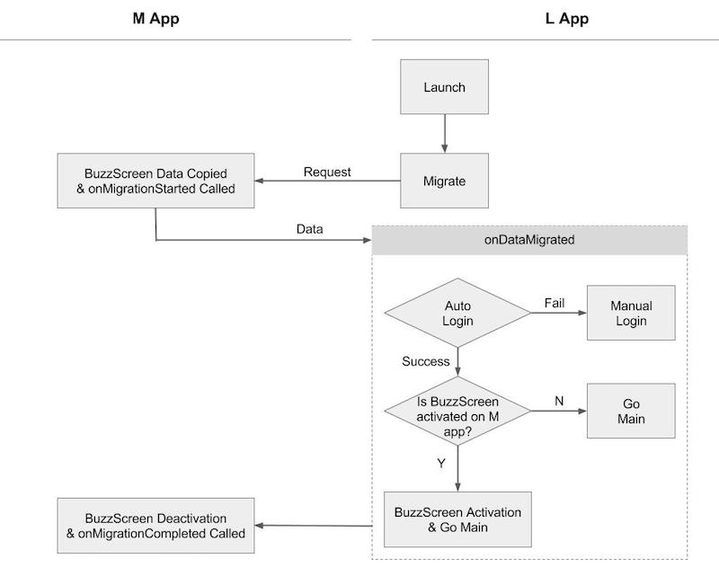

## L앱 마이그레이션 구현
참고 샘플 : **`sample_lock`**

### 1. M앱에서 연동한 버즈스크린 SDK를 L앱에도 동일하게 적용합니다.
- 버즈스크린 SDK 버전 1.6.0 이상 사용
- 단, `AndroidManifest.xml`의 `app_license`와 `com.buzzvil.locker.mediation.baidu.plist`는 새로 발급(버즈빌 문의)받아서 적용해야 합니다.
    `AndroidManifest.xml` 관련 코드
    ```
    <manifest>
        <application>
            ...
            <!-- Configuration for BuzzScreen-->
            <meta-data
                android:name="app_license"
                <!-- <app_license> 를 기존 M앱과 다른 새로운 값으로 교체합니다. -->
                android:value="<app_license>" />
            <meta-data
                android:name="com.buzzvil.locker.mediation.baidu.plist"
                <!-- <plist> 를 기존 M앱과 다른 새로운 값으로 교체합니다. -->
                android:value="<plist>" />
        </application>
    </manifest>
    ```

### 2. `build.gradle` 설정
       
#### `manifestPlaceholders` 추가

```
android {
   defaultConfig {
       // my_app_key 에는 버즈스크린 연동시 발급받은 앱키를 입력합니다.
       manifestPlaceholders = [buzzScreenAppKey:"my_app_key"]
   }
}
```

#### `dependencies` 에 추가
**M앱과 설정이 다름에 주의**합니다.

```
dependencies {
   compile 'com.buzzvil:buzzscreen-migration-to:+'
}
```

### 3. Application Class 에 코드 추가
- `MigrationTo.init(Context context, String mainPackageName)`

    마이그레이션을 위한 L앱의 초기화 코드

    **Parameters**
    - `context` : Application context 를 `this` 로 전달
    - `mainPackageName` : M앱의 패키지명


**사용 예시**

```java
public class App extends Application {

    @Override
    public void onCreate() {
        super.onCreate();

        // M앱과 동일한 기존 버즈스크린 초기화 코드.
        BuzzScreen.init("app_key", this, CustomLockerActivity.class, R.drawable.image_on_fail);

        // 마이그레이션을 위한 코드
        // M앱의 패키지명이 com.buzzvil.sample_main 인 경우 사용 예시
        MigrationTo.init(this, "com.buzzvil.sample_main");
    }
}

```

### 4. 마이그레이션 수행

버즈스크린 마이그레이션은 M앱에 있는 데이터를 L앱으로 그대로 가져와서 잠금화면을 자동으로 활성화 시키는 과정을 말합니다. 이 과정에서 마이그레이션 SDK를 통해 M앱의 데이터를 가져올 수 있고, 실제 잠금화면 활성화는 이 정보를 바탕으로 기존과 같이 직접 `BuzzScreen.getInstance().activate()`을 호출해야 합니다.

잠금화면을 활성화하는데 있어서 유저 정보를 통한 로그인이 필요하면 M앱의 `MigrationFrom.bind` 호출시에 유저 정보를 전달할 수 있습니다. 데이터 마이그레이션이 끝나면 자동으로 M앱의 잠금화면이 비활성화 되고 `activate()` 호출여부에 따라 L앱에서 잠금화면이 자동으로 활성화 됩니다.

#### 정상 마이그레이션 흐름


#### 마이그레이션 코드 추가
마이그레이션을 수행하려는 액티비티에 다음의 코드를 추가합니다. 마이그레이션 수행 함수는 최초로 실행되는 액티비티에서 호출해야 합니다.

- `migrate(OnMigrationListener onMigrationListener)`

    마이그레이션을 수행하는 MigrationTo 클래스의 멤버 함수입니다. OnMigrationListener 콜백을 통해 M앱의 데이터를 전달받고 잠금화면 활성화로직을 구현하면 됩니다.

    **Parameters**
    - `onMigrationListener` : 마이그레이션 리스너
        - `void onAlreadyMigrated()` : 이미 마이그레이션이 진행된경우 호출됩니다.
        - `void onDataMigrated(Bundle data, boolean usedLockscreen)` : M앱에서 데이터가 전달된 후에 호출됩니다. 전달받은 데이터, M앱에서 잠금화면 사용 유무, UserProfile 정보를 조합하여 자동으로 잠금화면 활성화 할지 결정합니다.
            - `data` : M앱의 마이그레이션 작업에서 `onMigrationStarted` 를 통해 전달된 데이터
            - `usedLockscreen` : M앱에서 버즈스크린 활성화 여부
        - `void onError()` : 마이그레이션 진행시 다음과 같은 경우에 호출됩니다.
            - M앱이 설치되지 않았을 때 : M앱의 잠금화면 활성화 과정처럼, 독자적으로 로그인을 진행하여 잠금화면을 활성화 합니다.
            - M앱의 버전이 마이그레이션 작업을 적용한 버전 미만일 때 : M앱의 잠금화면 활성화 상태를 확인할 수 없기때문에 잠금화면이 M앱과 L앱 둘다 활성화 되는 것을 막기 위해 무조건 M앱의 업데이트를 요구합니다.
            - 그 외의 에러 : 잘못된 연동 혹은 일시적인 에러로 발생할 수 있습니다. 일시적인 에러인 경우에는 재시도하거나, 독자적으로 로그인을 진행하여 잠금화면을 활성화 합니다.
            
**사용 예시**
```java
public class IntroActivity extends AppCompatActivity {

    private App app;
    private MigrationTo migration;
    
    // M 앱에서 기존에 잠금화면을 쓰고 있었는지 여부 저장
    private boolean usedLockScreen = false;

    @Override
    protected void onCreate(Bundle savedInstanceState) {
        super.onCreate(savedInstanceState);
        setContentView(R.layout.activity_intro);
        
        // Application 클래스내에 로그인 관련코드가 샘플로 구현되어 있다.
        app = (App) getApplicationContext();

        // 기존 버즈스크린 연동
        BuzzScreen.getInstance().launch();
    }

    @Override
    protected void onResume() {
        super.onResume();
        if (app.isLoggedIn()) {
            // 이미 로그인되어 있는 경우는 앱의 메인 화면으로 진입합니다.
            startMainActivity();
        } else {
            // 로그인되어있지 않은 경우는 마이그레이션을 통해 자동으로 로그인을 할 수도 있고, 수동으로 로그인을 요청할 수도 있습니다.
            // 마이그레이션시 유저이탈을 최소화하기 위해서는 자동로그인을 구현하는 것이 좋습니다.
            migration = new MigrationTo();
            migration.migrate(new MigrationTo.OnMigrationListener() {
                
                /**
                 * 마이그레이션은 최초에만 수행되고 그 이후 migrate 호출시에는 onAlreadyMigrated()가 호출됩니다.
                 */
                @Override
                public void onAlreadyMigrated() {
                    manualLogin();
                }
                
                /**
                 * M앱에서 데이터를 전달받고 UserProfile 정보가 업데이트된 이후 호출됩니다.
                 *
                 * @param data M앱의 마이그레이션 연동에서 `onMigrationStarted` 를 통해 전달된 데이터
                 * @param usedLockScreen M앱에서 버즈스크린 활성화 여부
                 */
                @Override
                public void onDataMigrated(Bundle data, boolean usedLockScreen) {
                    Log.d(TAG, "OnMigrationListener.onDataMigrated");
                    IntroActivity.this.usedLockScreen = usedLockScreen;
                    if (data != null) {
                        // M앱으로부터 받은 유저 정보를 사용하여 자동 로그인을 수행합니다.
                        // 자동로그인 성공시에는 usedLockScreen 에 따라 잠금화면 활성화 여부를 선택합니다.
                        // 자동로그인 실패시에는 유저의 액션이 필요한 수동로그인을 진행합니다.
                        String userId = data.getString("user_id");
                        requestLogin(userId);
                    } else {
                        // M 앱으로부터 받은 정보가 없으므로 수동로그인을 진행합니다.
                        useManualLogin();
                    }
                }

                @Override
                public void onError() {
                    Log.e(TAG, "OnMigrationListener.onError");
                    if (!Utils.isAppInstalled(IntroActivity.this, App.MAIN_APP_PACKAGE)) {
                        // M앱이 설치되지않은 경우, 자체 로그인을 구현하여 잠금화면을 사용할 수 있도록 구현합니다.
                        Toast.makeText(IntroActivity.this, "Main app is not installed.\nPlease install it or login.", Toast.LENGTH_LONG).show();
                        useManualLogin();
                    } else if (Utils.getAppVersionCode(IntroActivity.this, App.MAIN_APP_PACKAGE) < SUPPORTED_MAIN_APP_VERSION) {
                        // M앱 버전이 옛 버전인 경우 잠금화면이 중복으로 뜰 수 있으므로 L앱 사용을 막고 M앱의 업데이트를 요구합니다.
                        alertMustUpdate();
                    } else {
                        // 마이그레이션 과정시 일시적인 에러인 경우 재시도를 요구하거나 수동로그인을 통해 진입가능합니다.
                        useManualLogin();
                    }
                }
            });
        }
    }
    
    @Override
    public void onPause() {
        super.onPause();
        if (migration != null) {
            migration.abort();    
        }
    }
}

```
위 코드의 상세 구현은 `sample_lock`의 `IntroActivity`에서 확인할 수 있습니다.      
        
