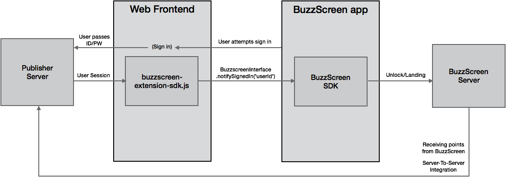
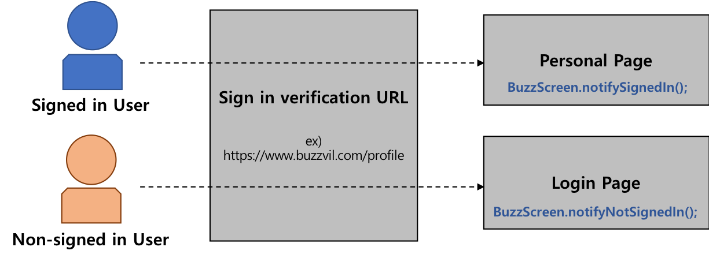

# BuzzScreen Extension JS SDK Guide
> [Korean Version Link](BUZZSCREEN-EXTENSION-JS-SDK-GUIDE-KR.md)

* An extension SDK that helps you to work with the [BuzzScreen](https://github.com/Buzzvil/buzzscreen-sdk-publisher) which shows personalized content and ads on Android lockscreen.
* You need user information to use the personalization feature in BuzzScreen, and you need to pass user information to the BuzzScreen app via this SDK.
* This guide explains how you can apply this SDK to publisher's web site.

## Sign in and point accumulation request flow


1. The user tries to login by clicking the login button on the BuzzScreen Android client. At this time, the Android app opens the web front-end site of the publisher through [WebView](https://developer.android.com/reference/android/webkit/WebView.html) and shows it to the user.
2. The user attempts to sign in from the web front-end of the publisher that is visible on the [WebView](https://developer.android.com/reference/android/webkit/WebView.html).
3. The publisher's web front-end receives the information for the user's login and passes it to the publisher's server.
4. The publisher's server forwards the session information of the successfully signed-in user to the web front-end.
5. (Publisher's task) The publisher's web front-end confirms that the user has signed in and calls the BuzzScreen Extension JS SDK function to pass user information.
6. BuzzScreen Extension JS SDK passes user information to Android client through [Javascript Interface](https://developer.android.com/guide/webapps/webview.html#BindingJavaScript) provided by Android. This information is passed to the BuzzScreen server, which allows the Android client to receive the proper ad.
7. The Android client uses the BuzzScreen SDK to communicate to the BuzzScreen server when it detects that the user is performaing an action such as landing on the ad.
8. The BuzzScreen server passes the userId and the point information it has received to the publisher's serve r to indicate how many points the particular user should receive.
9. (Publisher's task) The publisher's server receives the above information and assigns points to the user.

## Publisher's task
What the publisher needs to do is shown in blue in the figure above.

* Sign in integration: If the user is successfully signed in from the publisher's website, this sdk should be used to pass user information to BuzzScreen. This is explained in detail in the rest of this guide.
* Postback integration: If the user gets points to earn by doing something like landing on an ad, the publisher's server needs to be integrated to receive the notification and take appropriate action. Please refer to [this guide for postback APIs](https://github.com/Buzzvil/buzzscreen-sdk-publisher/blob/master/docs/POSTBACK_EN.md).

## Sign in integration
For the integration of the login, the publisher should notify Buzzvil of the **sign in verification URL** and the **sign out URL** and **set up 'sign in verification URL' for SDK integration** according to the following.

### 1. Sign in verification URL



The sign in verification URL is necessary to check whether the user has signed in or not. To do this, the signed-in user and the non-signed-in user must see different pages at the same URL. In this case, you can call the different functions of this SDK on each page to distinguish whether the user has signed in or not.

For example, suppose here is an address `https://www.buzzvil.com/profile`. This address is for accessing the page with the account information of the user logged into the site. Then, you can notify that the user has signed in by loading this SDK from the user account information page, calling API and passing the user information to BuzzScreen.

If a user who doesn't signed in accesses the above address, a login page asking for ID and password is shown. Then, you can notify that the user doesn't signed in by loading this SDK from the login page and calling API.

The approximate role of each page is summarized as follows.
* For user not signed in: show sign in button and notify "not signed in" to BuzzScreen
* For user signed in: show signed in page and notify "signed in" to BuzzScreen

### 2. Sign out URL
If the user signed out the lock screen, an URL is needed that allows her to sign out also from the publisher's website normally. This address is used by the Android application. For example, if an user can signed out by accessing `https://www.buzzvil.com/logout`, the Android application will access the above address and sign out when the user wants to do.

## How to apply

Insert this SDK on each of the two pages accessible by the "Sign in verification URL".
```html
<script src="buzzscreen-extension-0.0.1.js"></script>
```

### Notify "not signed in"

On the page that is accessed when the user doesn't sign in, call the following JavaScript code:
```html
<script>
BuzzScreen.notifyNotSignedIn();
</script>
```

### Notify "signed in"

On the page that is accessed when the user has signed in, call the following JavaScript code to pass the user information (user ID, year of birth and gender) and to notify that the user has signed in.
```html
<script>
BuzzScreen.notifySignedIn('userId', 1990, BuzzScreen.GENDER_MALE);
BuzzScreen.notifySignedIn('userId', 1990, BuzzScreen.GENDER_FEMALE);
</script>
```
The type of each argument is `string`, `number`, `string` in that order. If the arguments are set incorrectly, error logs are left in the console window. Be careful not to set the arguments incorrectly.

You may want to work with BuzzScreen instead of passing the user's birthYear and gender as follows.
> Note: If you do not set targeting information such as year of birth, gender, etc, targeted ads will not be allocated to lockscreen, which will reduce the total number of ads users can see.
```html
<script>
BuzzScreen.notifySignedIn('userId');
</script>
```

## Functions for SDK configuration convenience

### Check the page is loaded in BuzzScreen [Webview](https://developer.android.com/reference/android/webkit/WebView.html)
The following API returns `true` if loaded from BuzzScreen [Webview](https://developer.android.com/reference/android/webkit/WebView.html), or `false`.
```html
<script>
const result = BuzzScreen.isBuzzScreenWebView();
</script>
```

### See detailed logs
If you set the verbose option to `true`, you can also view logs at the `console.info` level.
```html
<script>
BuzzScreen.setVerbose(true);
BuzzScreen.notifySignedIn('userId', 1990, BuzzScreen.GENDER_MALE);
</script>
```
