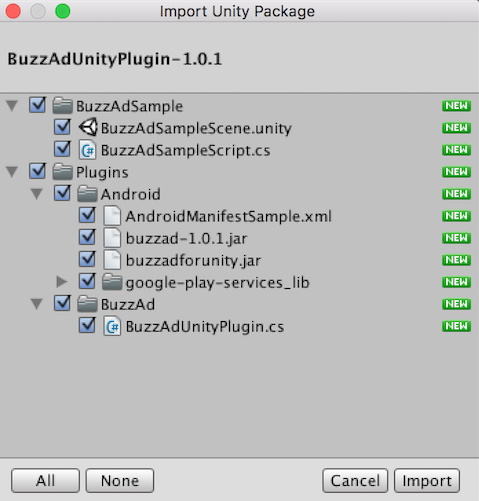

# BuzzAd Unity Android Plugin
- 버즈애드를 유니티에 연동하기 위한 플러그인 (Android 전용)
- 안드로이드 버전 지원 : Android 2.3(API Level 9) 이상
- SDK 연동 및 샘플 어플리케이션 실행을 위해서는 `app_key`(버즈애드 퍼블리셔 어드민에서 확인 가능) 필요

## 유니티 SDK 연동가이드
### 설정
- [SDK 다운로드](https://github.com/Buzzvil/buzzad-sdk-publisher/archive/master.zip) 후 압축 해제. buzzad-unity-sdk/ 디렉토리 안 BuzzAdUnityPlugin.unitypackage 를 추출한다.
- 적용할 유니티 프로젝트를 켠 상태에서 unitypackage파일을 실행하면 다음과 같이 plugin 파일들이 해당 프로젝트에 import되는 형태를 확인할 수 있다. 모두 체크된 상태에서 `import` 버튼을 누른다.



> **주의** : 기존에 이미 google play service 라이브러리를 사용하던 경우에는 패키지 중 Plugins/Android/google-play-services_lib/ 의 체크를 해제하여 중복으로 import 하지 않도록 한다.

- AndroidManifest.xml : 아래와 같이 권한, 구글 플레이 서비스 세팅, 액티비티를 설정한다.

```Xml
<manifest>
    ...
    <!-- Permission for BuzzAd -->
    <uses-permission android:name="android.permission.INTERNET" />

    <application>
        ...
        <!-- Setting for Google Play Services -->
        <meta-data
            android:name="com.google.android.gms.version"
            android:value="@integer/google_play_services_version" />

        <!-- Activity for BuzzAd -->
        <activity
            android:name="com.buzzvil.buzzad.sdk.OfferWallActivity"
            android:theme="@android:style/Theme.Translucent.NoTitleBar" />
    </application>
</manifest>
```
> 패키지에 첨부되어 있는 AndroidManifestSample.xml은 설정을 적용한 예시로, 이 파일의 주석을 참고하여 기존 AndroidManifest.xml 파일에 적용한다.

##### Proguard 설정
Proguard 사용시에 다음 라인들을 Proguard 설정에 추가한다.

```
-keep class com.buzzvil.buzzad.sdk.** {*;}
-keep interface com.buzzvil.buzzad.sdk.** {*;}

-keep class com.google.android.gms.common.GooglePlayServicesUtil {*;}
-keep class com.google.android.gms.ads.identifier.AdvertisingIdClient {*;}
-keep class com.google.android.gms.ads.identifier.AdvertisingIdClient$Info {*;}
```

### 오퍼월 호출
- `BuzzAd.getInstance.init(String app_key);` : 오퍼월을 호출하려는 오브젝트 스크립트의 `Start()` 에서 호출한다. 다른 모든 메소드를 호출하기 이전에 호출해야 한다.

    > `app_key`는 퍼블리셔 어드민 페이지에 로그인하여 확인.

- `BuzzAd.getInstance.showOfferWall(String title, String userId)` : 오퍼월 호출

    > 이 때 전달되는 `userId`(매체사 유저 아이디)는 포인트 적립 요청시(4. 포인트 적립 요청 참고)에 같이 전달된다. 이 값을 통해 매체사가 유저를 구분하여 포인트 지급 처리를 할 수 있다.
    
    > **주의** : 반드시 `BuzzAd.getInstance.init()` 을 호출한 이후에만 오퍼월 호출이 가능하다.

### 타게팅 정보 추가(선택사항)
성별, 나이별 타게팅 정보를 가진 광고를 유저에게 보여주려 할 때 다음의 메소드를 통해 유저의 정보를 입력할 수 있다.

> **주의** : 반드시 `BuzzAd.getInstance.init()` 을 호출한 이후에만 타게팅 정보 추가가 가능하다.

- `BuzzAd.getInstance.setGender(String gender)` : 성별을 설정한다. 다음과 같은 미리 정의된 String을 통해 형식에 맞춰 성별을 적용해야 한다.
    - `BuzzAd.USER_GENDER_MALE` : 남성인 경우
    - `BuzzAd.USER_GENDER_FEMALE` : 여성인 경우

- `BuzzAd.getInstance.setBirthYear(int birthYear)` : 유저의 출생 년도를 4자리의 숫자로 입력하여 나이를 설정한다.

### 샘플 사용법
패키지 내 `BuzzAdSample/` 디렉토리에 들어있는 버즈애드 적용 샘플 사용법이다.

- BuzzAdSampleScript.cs 를 열고 `BuzzAd.getInstance.init("app_key")` 의 app_key를 제공받은 앱 키로 대체한다.
- BuzzAdSampleScene.unity 씬을 Android로 빌드한다.
- 빌드된 앱을 안드로이드 단말기에서 실행하면 오퍼월을 호출할 수 있는 버튼이 생성된다.

## 포인트 적립 요청(포스트백) - 서버 연동
[포인트 적립 요청 가이드](https://github.com/Buzzvil/buzzad-sdk-publisher#포인트-적립-요청포스트백----서버-연동) 참고