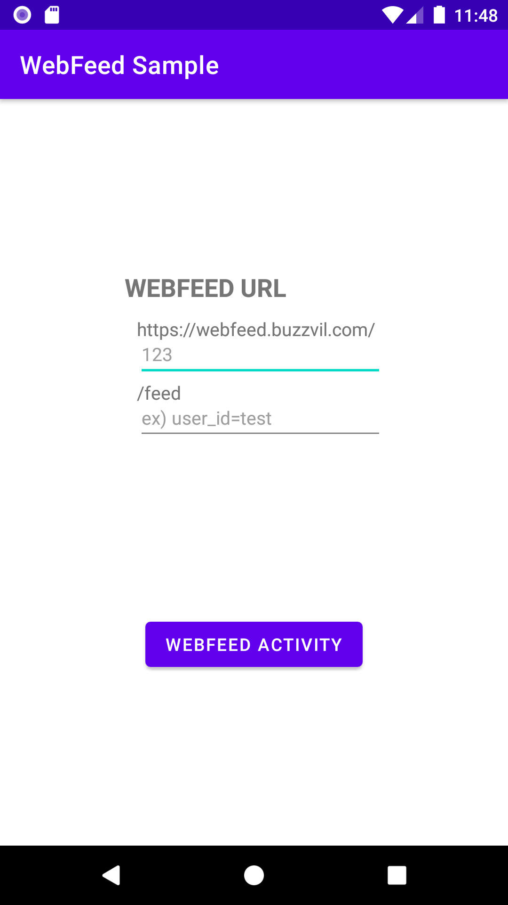
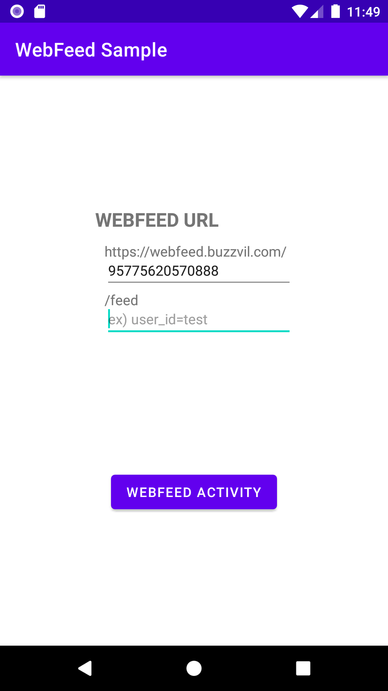
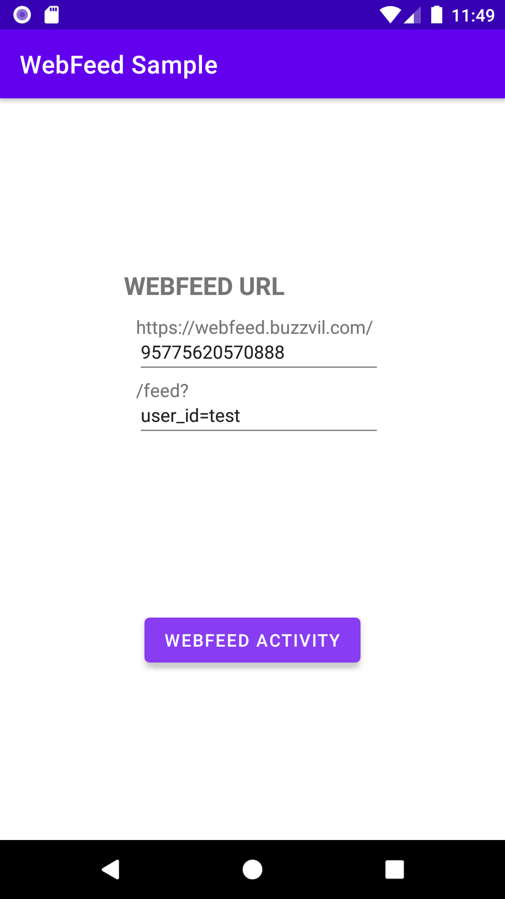
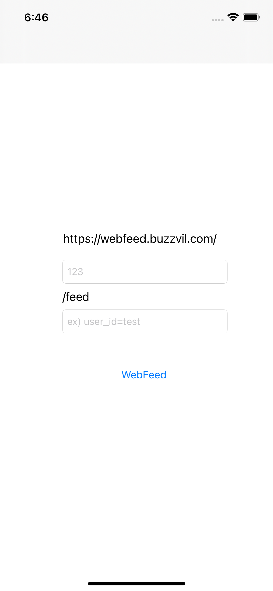
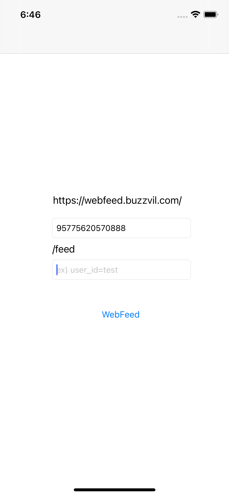

# Feed(Web) 웹뷰 연동 샘플 코드
본 저장소는 Feed(Web)의 연동 편의를 위하여 웹뷰 연동 샘플 코드를 제공합니다.

## 일러두기
* Feed(Web)은 웹뷰 환경도 최대한 고려하여 개발하고 있습니다. 하지만 제약이 많은 웹뷰 환경의 특성상 다양한 문제가 발생할 수 있기 때문에 인앱 브라우저 보다는 **모바일 브라우저로 Feed(Web)을 열도록 하는 것을 권장**합니다.
* 샘플 코드를 그대로 사용하는 것보다는, 특히 웹뷰의 설정을 잘 이해하고 각각의 환경에 맞추어 구현하시는 것을 권장합니다.

## 플랫폼

### /android
안드로이드 앱 샘플 코드입니다.

### /ios
아이폰 앱 샘플 코드입니다.

## 샘플앱 주요 기능

샘플앱은 다음의 공통된 주요 기능을 가집니다.

* 주소에서 App ID와 URL 파라미터를 설정할 수 있습니다.
* 설정한 주소로 웹피드를 열어줍니다.
* 새 탭으로 열기로 설정된 링크(target="_blank")는 외부 브라우저로 연결합니다.
* 그 외 일반적인 링크는 웹뷰 안에서 이동합니다.

## 스크린샷

### 안드로이드

   

### iOS 
   

